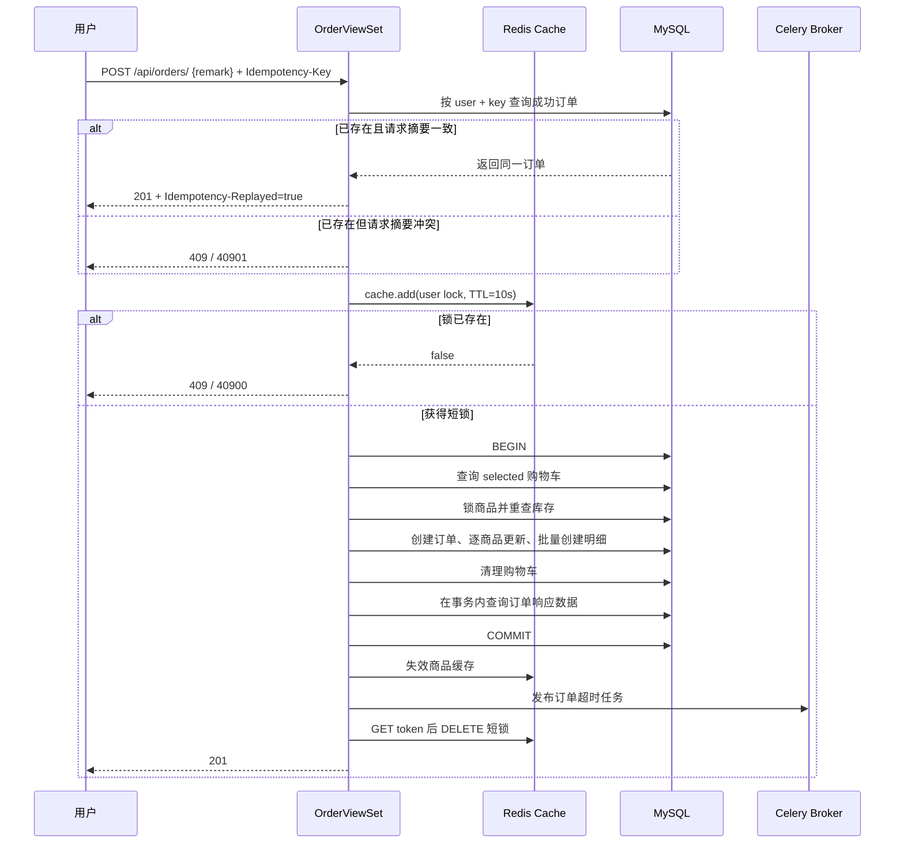
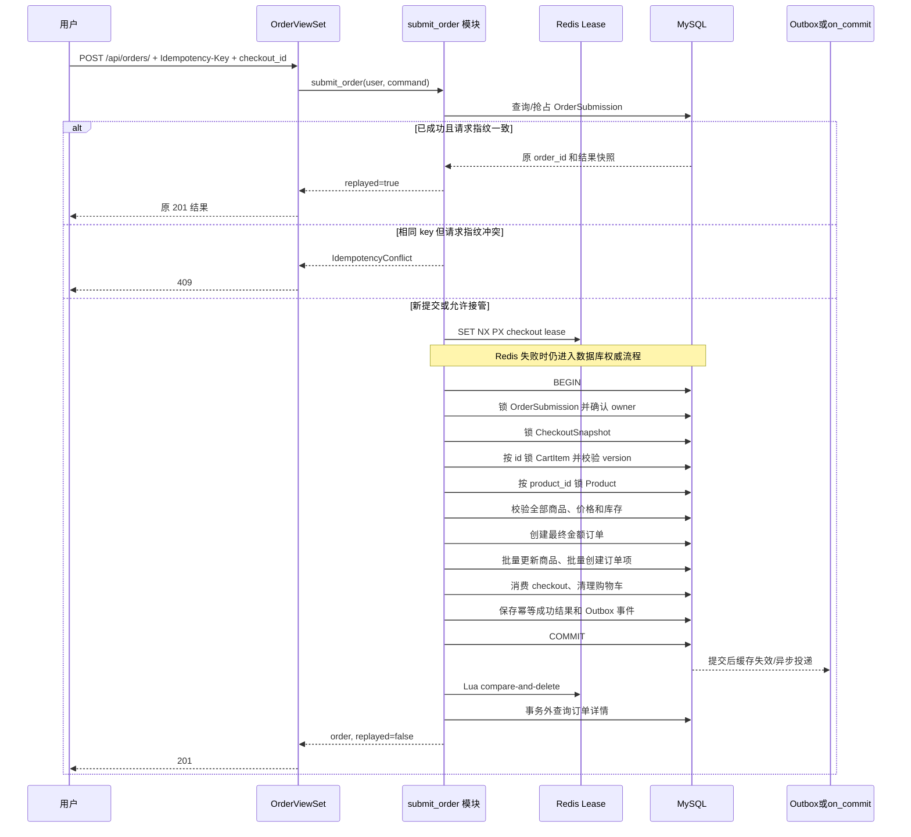

# 订单创建流程优化设计文档

## 1. 文档状态与目标

本文最初基于提交 `d140d9c` 的订单代码编写，检查日期为 2026-08-05。

本文整体仍是一份**优化设计方案**。当前工作区已经落地第一阶段的最小数据库幂等：`Order.idempotency_key`、`Order.request_hash`、`(user, idempotency_key)` 唯一约束、必填 `Idempotency-Key` 请求头、相同请求订单身份重放和 `40901` 内容冲突。文中完整的 `OrderSubmission`、`CheckoutSnapshot`、购物车版本、Lua 租约、批量库存更新和 Outbox 仍是未实现建议，不能描述成当前功能。

本文希望解决五类问题：

1. 用户重复点击、网络重试和响应丢失时，避免同一次业务提交创建多张订单。
2. 结算页展示内容与真正下单内容保持一致，避免购物车被并发修改后静默创建意外订单。
3. 缩短数据库事务和商品行锁的持有时间，减少高并发下的等待与死锁概率。
4. 将随购物车商品数量线性增长的 SQL 更新改为批量操作。
5. 建立真实 MySQL、Redis、多 Worker 环境下的验证和监控方法。

优化原则：

- MySQL 保存订单、库存、结算快照和幂等结果，是最终事实来源。
- Redis 只负责快速协调和削峰，不承担订单唯一性的最终保证。
- `transaction.atomic()` 只负责数据库操作一起提交或一起回滚。
- `select_for_update()` 只负责串行化被锁数据库行上的并发修改。
- 消息队列只负责触发后续处理，消费者仍需重新检查数据库状态。
- 不信任客户端提交的价格、总金额、库存和商品状态。

## 2. 当前已经实现的下单流程

### 2.1 真实调用链

当前入口和主要实现：

```text
POST /api/orders/
  -> apps/orders/views.py: OrderViewSet.create()
  -> apps/orders/serializers.py: OrderCreateSerializer
       -> 校验可选 remark 和必填 Idempotency-Key 请求头
  -> apps/orders/services.py: create_order_from_cart()
       -> 按 user + idempotency_key 查询已成功订单
       -> 相同请求直接返回同一订单，不同请求返回 40901
       -> Redis 10 秒用户级防重复提交锁
       -> transaction.atomic()
       -> 查询当前用户 selected=True 的购物车行
       -> select_for_update() 锁定商品
       -> 校验商品状态、分类状态和库存
       -> 创建 total_amount=0 的订单
       -> 逐商品扣库存、增加销量并 save()
       -> bulk_create() 创建订单项价格快照
       -> 更新订单总金额
       -> 删除已经结算的购物车行
       -> 注册提交后缓存失效回调
       -> 注册提交后订单超时消息回调
       -> 在事务内重新查询订单详情
  -> 提交事务
  -> 执行 on_commit 回调
  -> 释放 Redis 锁
  -> 返回 201
```

### 2.2 当前各机制分别保护什么

| 当前机制 | 保护的内容 | 不能解决的问题 |
|---|---|---|
| `cache.add(lock:order:create:user:{user_id}:idempotency:{idempotency_key})` | 短时间内同一用户、同一幂等键只有一个创建请求进入主要流程 | TTL 过期、响应丢失后的重试、不同幂等键重复消费同一购物车、持久化结果重放 |
| `transaction.atomic()` | 库存、订单、订单项和购物车清理一起提交或回滚 | 不会自动防止超卖，也不会识别重复业务请求 |
| 商品 `select_for_update()` | 同一商品的库存检查和修改串行执行 | 不锁购物车，也不代表订单创建严格幂等 |
| `order_no unique=True` | 每个服务端订单号唯一 | 无法证明两个不同订单是否来自同一次客户端提交 |
| `(user_id, idempotency_key)` 唯一约束 | 同一用户、同一 key 最多保存一个成功订单 | 不保存失败结果，也不能阻止不同 key 重复消费同一购物车批次 |
| `transaction.on_commit()` 缓存失效 | 只在数据库提交成功后清理相关商品缓存 | Redis 与 MySQL 仍是最终一致，不是分布式事务 |
| Celery ETA + Beat 扫描 | 到期后触发取消，并补偿发布失败或漏处理 | 消息可以延迟或重复，最终判断仍依赖订单状态和 `expires_at` |

### 2.3 当前时序



### 2.4 当前值得保留的设计

以下做法是正确基础，优化时不应删除：

- 库存检查必须在获得商品行锁后重新执行。
- 库存、销量、订单、订单项和购物车清理必须留在同一个数据库事务中。
- `OrderItem` 保存商品名称、成交单价和小计快照，历史订单不能依赖商品当前价格。
- 商品缓存失效必须在事务提交后执行。
- 超时取消必须锁定订单、重查 `pending` 和 `expires_at`，再锁商品恢复库存。
- Celery 重复消息必须继续通过数据库状态检查实现业务幂等。

## 3. 优化后的核心不变量

优化完成后，应明确保证以下不变量：

1. 同一用户、同一个 `Idempotency-Key`、同一请求内容，最多创建一张订单，并可重放首次结果。
2. 同一用户、同一个 `checkout_id`，最多消费一次，不因更换幂等键创建第二张订单。
3. 同一个幂等键携带不同请求内容时拒绝执行，不能返回一个不匹配的旧结果。
4. 订单项必须来自一份确定的结算快照；购物车在快照后发生变化时，系统按明确策略拒绝或要求重新确认。
5. 所有商品锁按相同顺序获取；并发下库存不能被扣成负数。
6. 事务回滚后不能遗留订单、订单项、库存扣减、已消费快照或成功幂等结果。
7. 数据库已经提交但 HTTP 响应丢失时，客户端重试能够拿到原订单，而不是收到“购物车为空”。
8. Redis 短锁过期、释放失败或 Redis 暂时不可用时，数据库唯一约束仍能阻止重复订单。

## 4. 第一步：建立统一的订单提交模块接口

### 4.1 当前情况

`OrderViewSet.create()` 直接调用：

```python
create_order_from_cart(user=request.user, remark=remark)
```

随着幂等、快照、Redis 租约、事务、消息和结果重放加入，如果继续给 ViewSet 增加参数和分支，调用者必须理解越来越多内部实现，接口会逐渐变浅且难以测试。

### 4.2 建议变化

在 `apps/orders/submission.py` 建立订单提交 seam，对 ViewSet 和测试只暴露一个深模块接口：

```python
@dataclass(frozen=True)
class SubmitOrderCommand:
    checkout_id: UUID
    idempotency_key: str
    remark: str = ""


@dataclass(frozen=True)
class OrderSubmissionResult:
    order: Order
    replayed: bool


def submit_order(user, command: SubmitOrderCommand) -> OrderSubmissionResult:
    ...
```

ViewSet 只负责：

- 身份认证。
- 解析 `Idempotency-Key` 请求头。
- 使用 Serializer 校验字段格式。
- 构造 `SubmitOrderCommand`。
- 把模块返回结果或业务异常映射为 HTTP 响应。

`submit_order()` 的实现内部隐藏：

- 幂等记录抢占和结果重放。
- 结算快照检查。
- Redis 租约。
- 数据库事务和锁顺序。
- 订单、订单项、库存和购物车写入。
- 缓存失效和超时任务投递。

Redis key、Lua、token、TTL、ORM QuerySet 和 Celery 调用不进入外部接口。

### 4.3 效果

- ViewSet 不需要了解并发实现，接口复杂度保持稳定。
- 业务测试和调用者通过同一个 seam 验证结果，内部由逐条 `save()` 改成 `bulk_update()` 时无需修改接口测试。
- 幂等、快照、库存、事务和消息知识集中在一个模块中，问题定位具有更好的 locality。
- 后续如果增加移动端、管理端或内部调用，不需要复制下单规则。

### 4.4 代价与注意事项

- 不要为了“分层”把每个 ORM 操作包装成只有一行代码的浅模块。
- Redis 租约可以作为提交模块内部 seam；只有确实需要生产 Redis adapter 和测试 adapter 时才定义单独接口。
- 原来的 `create_order_from_cart()` 可以在迁移期调用新模块，但最终应避免两套下单实现并存。

### 4.5 验收标准

- ViewSet 不直接调用 Redis、事务、商品 ORM 或 Celery。
- 订单提交行为测试主要通过 `submit_order()` 接口完成。
- 删除该模块会迫使幂等、快照、库存和消息逻辑散回多个调用者，说明这个深模块确实提供了 leverage。

## 5. 第二步：增加数据库级严格幂等

### 5.1 优化前情况与当前最小落地

优化前客户端没有提交业务请求身份，Redis 锁的 key 只有用户 ID，TTL 为 10 秒。

当前工作区已经实现最小版本：key 和请求摘要直接保存在成功的 `Order` 上，并由 `(user_id, idempotency_key)` 唯一约束兜底。这个版本可以重放成功订单身份并拒绝相同 key 的不同 `remark`，但尚未持久化处理中状态、失败结果或不可变 checkout；本节后续的 `OrderSubmission` 仍是生产级下一阶段建议。

- 同时提交时，第二个请求得到 `40900`。
- 第一个请求成功但响应在网络中丢失后，用户重试通常只会看到购物车已经为空。
- 如果第一个请求超过 10 秒，锁可能先过期，第二个请求能够再次进入。
- `order_no` 每次由服务端重新生成，不能识别“这是不是同一次下单”。

### 5.2 建议变化

客户端每次新的下单意图生成一个随机 `Idempotency-Key`，例如 UUID，并放在请求头：

```http
Idempotency-Key: 0d17cd55-4904-4ef2-b4a9-cce6e2066a12
```

建议新增 `OrderSubmission` 模型，核心字段见第 17 节。数据库至少建立：

```text
UNIQUE(user_id, idempotency_key)
UNIQUE(user_id, checkout_id)
```

服务端对规范化请求计算 `request_hash`：

```text
SHA-256(canonical_json({checkout_id, remark}))
```

用户 ID 已经是唯一约束的一部分，不需要相信客户端传入的用户 ID。价格、总金额和库存不进入客户端请求指纹，因为这些字段只能由服务端决定。

### 5.3 建议处理语义

| 场景 | 建议结果 |
|---|---|
| 新 key、新 checkout | 抢占提交记录并执行下单 |
| 相同 key、相同请求、首次已成功 | 返回原订单，`replayed=true` |
| 相同 key、不同请求内容 | 返回 409，建议业务码 `40901` |
| 相同 checkout、不同 key、请求内容相同 | 返回该 checkout 已创建的原订单 |
| 相同 checkout、不同 key、内容冲突 | 返回 409，禁止创建第二张订单 |
| 首次请求仍在处理且租期未过 | 返回 409/202，建议携带 `Retry-After` |
| 首次处理进程崩溃且处理租期已过 | 新 owner 在数据库中接管后重试完整事务 |
| 确定性业务失败，例如库存不足 | 保存或稳定返回同一失败；重新尝试新的业务意图应使用新 key/新 checkout |
| 瞬时系统失败，例如数据库连接中断 | 标记为可重试或等待处理租期到期，不能保存为永久业务失败 |

建议的提交记录状态：

```text
processing -> succeeded
processing -> failed
processing --租期过期--> 被新 owner 接管
```

`owner_token` 和 `processing_expires_at` 用于避免旧进程在接管后继续写成功结果。真正写订单前必须锁定 `OrderSubmission` 行并再次确认 owner。

### 5.4 效果

- 重复点击、客户端自动重试、网关重试和响应丢失不会创建重复订单。
- 客户端能拿回首次订单 ID 和首次响应，不再把“购物车为空”误认为下单失败。
- Redis TTL 过期时仍有 MySQL 唯一约束兜底。
- 幂等冲突变得可观察，可以区分重复重放和错误复用 key。

### 5.5 代价与注意事项

- 需要定义提交记录保留时长和清理任务，例如保留 24 小时或更长；不能在客户端仍可能重试时提前删除。
- 不应记录敏感请求头；日志可记录 key 的哈希或短前缀，不记录完整个人数据。
- 捕获唯一约束竞争时，要在可恢复的 savepoint 或新事务中重新查询，不能在已经标记为回滚的 Django 事务中继续 ORM 操作。
- `failed` 必须区分确定性业务失败和瞬时基础设施失败。
- 幂等记录不能在订单事务提交前提前标记 `succeeded`。

### 5.6 验收标准

- 100 个相同 key 的并发请求最终只有一个订单 ID。
- 首次事务提交后模拟 HTTP 断开，重试返回同一订单 ID。
- Redis 停机或短锁提前过期时，同一 key/checkout 仍最多创建一张订单。
- 相同 key 修改 `remark` 或 `checkout_id` 后稳定返回冲突，不执行库存修改。

## 6. 第三步：增加不可变结算快照

### 6.1 当前情况

当前创建请求只携带 `remark`，服务端在收到请求时读取所有 `selected=True` 的购物车行。这意味着用户在结算页看到的内容和真正进入事务时读取的内容可能不同：

- 用户打开结算页后又修改数量。
- 另一个标签页取消选中或删除商品。
- 商品价格、状态或分类状态发生变化。
- 用户第一次请求已成功但响应丢失，购物车被清空，重试无法定位原业务批次。

### 6.2 建议变化

建议增加结算预览接口：

```http
POST /api/checkouts/
```

服务端从当前选中购物车生成不可变的 `CheckoutSnapshot` 和 `CheckoutSnapshotItem`，返回 `checkout_id`、展示金额和过期时间。

快照项至少保存：

- `cart_item_id`
- `cart_version`
- `product_id`
- `product_name`
- `unit_price`
- `quantity`
- `subtotal`

建议快照有效期为一个可配置的短时间，例如 10 分钟。具体时长属于业务策略，不应写死在 ViewSet。

### 6.3 建议价格策略

本项目建议采用“提交时重查并要求重新确认”策略：

1. 生成快照时保存用户看到的价格和金额。
2. 提交时锁定商品，读取当前服务端价格、状态和库存。
3. 如果价格或可售状态与快照不一致，拒绝旧快照，建议返回 `40006`，让客户端重新生成结算快照。
4. 客户端不能直接传入一个新价格覆盖服务端价格。

也可以选择在短有效期内冻结价格，但这需要明确促销、改价和亏损承担规则，不能只靠技术代码默认决定。

### 6.4 效果

- `checkout_id` 成为稳定的业务批次身份，和 `Idempotency-Key` 共同定位一次订单意图。
- 用户看到什么、确认什么、最终创建什么可以被审计。
- 同一个用户可以区分多个独立结算批次，不再全部依赖一个用户级 Redis key。
- 响应丢失后可以通过 checkout 找回原订单。

### 6.5 代价与注意事项

- 快照会增加表和存储，需要定期清理过期且未消费的数据。
- 快照必须不可变；变化时创建新快照，不能覆盖旧快照后继续沿用原 idempotency key。
- 订单项仍要保存最终成交快照，不能只引用 CheckoutSnapshotItem。
- 应限制一次结算的商品种类数量，例如最多 100 种，防止超大 `IN` 查询和批量 SQL。

### 6.6 验收标准

- 修改购物车数量后提交旧快照会被拒绝，不会静默按新数量或旧数量下单。
- 商品价格变化后提交旧快照返回明确的“结算信息已变化”。
- 同一 checkout 即使换了幂等键也不能创建第二张订单。
- 过期 checkout 不能继续下单，重新结算会获得新的 checkout ID。

## 7. 第四步：统一购物车并发规则

### 7.1 当前情况

当前下单事务没有锁 `CartItem`；购物车 PATCH、DELETE 和清空操作也没有统一使用 `transaction.atomic()` 与 `select_for_update()`。数据库 UPDATE/DELETE 最终会获取写锁，但调用方可能已经基于一个过期的购物车对象完成校验。

### 7.2 建议变化

建议给 `CartItem` 增加单调递增的 `version` 字段：

```text
version = 1, 2, 3, ...
```

每次数量或选中状态变化时，在事务中锁定购物车行并递增 version。生成结算快照时保存 `cart_item_id + cart_version`。

提交订单时：

1. 按 `CartItem.id` 排序并使用 `select_for_update()` 锁定快照关联的购物车行。
2. 检查购物车行仍属于当前用户。
3. 检查行仍存在、仍被选中、quantity 和 version 与快照一致。
4. 任意一项不一致时拒绝整个旧快照。
5. 成功创建订单后只删除本次快照对应且版本一致的购物车行。

购物车增加、修改、删除、清空也应采用相同的加锁顺序。对于并发增加同一商品，不能只依靠 `get_or_create()` 后在 Python 中执行 `old_quantity + quantity`；应锁定已有行或使用受约束的原子更新，处理唯一约束竞争。

### 7.3 效果

- 结算与购物车修改之间不再出现静默丢失更新。
- 下单删除购物车时不会误删用户在另一标签页刚刚更新过的内容。
- 并发增加同一商品时数量不会因为“最后一次保存覆盖前一次保存”而丢失。

### 7.4 代价与注意事项

- 只在下单代码里增加 `select_for_update()` 不够；购物车写路径也要遵守同一事务规则。
- 锁购物车和锁商品必须规定全局顺序，建议始终“提交记录/快照 → 购物车 → 商品 → 订单写入”。
- 如果产品策略允许结算后继续编辑购物车，也必须通过 version 判断，不要用“用户不能同时操作”作为假设。

### 7.5 验收标准

- PATCH 与下单并发时，结果只能是“修改先完成后旧快照失效”或“下单先完成后修改得到明确失败”，不能创建内容不确定的订单。
- 清空购物车与下单并发时没有 500、重复订单或错误库存。
- 两个并发增加请求的最终数量等于两次增量之和，且不违反库存上限。

## 8. 第五步：把 Redis 锁降级为辅助租约并原子释放

### 8.1 当前情况

当前 key：

```text
lock:order:create:user:{user_id}:idempotency:{idempotency_key}
```

当前释放步骤是：

```text
GET key
比较 token
DELETE key
```

GET 和 DELETE 不是一个原子操作。极端情况下，旧 key 在 GET 后过期，新请求写入新 token，旧请求随后 DELETE，可能误删新请求的锁。

### 8.2 建议变化

建议租约按 checkout 粒度：

```text
lock:order:submit:user:{user_id}:checkout:{checkout_id}
```

获取使用：

```text
SET key owner_token NX PX 30000
```

释放使用 Lua compare-and-delete：

```lua
if redis.call('get', KEYS[1]) == ARGV[1] then
    return redis.call('del', KEYS[1])
end
return 0
```

确实存在长事务时，续租使用 compare-and-PEXPIRE；续租失败只表示失去 Redis 租约，不能绕过或撤销 MySQL 幂等检查。

### 8.3 建议故障策略

数据库幂等完成后，建议 Redis 故障采用 fail-open：

- Redis 正常：快速拦截同 checkout 的并发请求，减少数据库热点等待。
- Redis 不可用：记录告警，继续进入 MySQL 幂等和行锁流程。
- Redis 租约丢失：数据库唯一约束、提交记录 owner token 和 checkout 唯一约束继续保证正确性。

如果业务选择 fail-closed，也必须明确“Redis 故障期间所有用户都无法下单”的可用性代价。

### 8.4 效果

- 旧 owner 不会误删新 owner 的租约。
- 一个用户的不同 checkout 不会被粗粒度用户锁无条件互相阻塞。
- Redis 从正确性单点降为性能优化；短暂故障不会自动演变成重复订单。

### 8.5 代价与注意事项

- 仅仅换成 Lua 仍不等于严格幂等；必须先有数据库记录和唯一约束。
- 不应无限续租。请求超过最大事务时长时应告警并调查慢 SQL、锁等待或外部调用。
- 数据库事务内不得执行耗时网络调用；否则租期再长也只是掩盖问题。
- 如果未来锁保护数据库之外不可回滚的资源，需要资源端 fencing token；当前纯数据库订单写入优先依靠数据库行锁和 owner 检查。

### 8.6 验收标准

- 构造“旧 token GET 后过期、新 token 写入”的场景，旧 owner 无法删除新锁。
- TTL 在请求处理中提前到期时仍只产生一个订单。
- Redis 停机时下单按既定 fail-open/fail-closed 策略稳定工作，并产生监控告警。

## 9. 第六步：缩短数据库事务和商品锁持有时间

### 9.1 当前情况

当前 `get_order_for_response(order.id)` 位于 `transaction.atomic()` 内部。Python 会先执行返回表达式，再退出 `with`，因此订单、订单项、商品的响应查询发生在事务提交前，商品行锁也会继续持有。

另外，订单在全部商品校验完成前先以 `total_amount=0` 插入，之后再更新最终总金额。事务回滚能保证正确性，但产生了不必要的写入。

### 9.2 建议变化

事务内只保留决定业务结果所必需的数据库操作：

```python
with transaction.atomic():
    # 锁提交记录、快照、购物车和商品
    # 完成全部校验并计算 total_amount
    # 创建最终金额订单
    # 批量更新商品、批量创建订单项
    # 消费 checkout、清理购物车、保存幂等成功结果
    # 写 outbox 或注册 on_commit
    order_id = order.id

# 已提交并释放数据库行锁
order = get_order_for_response(order_id)
return OrderSubmissionResult(order=order, replayed=False)
```

必须在事务外执行：

- 响应对象重新查询和序列化。
- 不参与数据库原子性的外部网络请求。
- 可异步完成的日志、通知和统计。

缓存失效继续使用 `transaction.on_commit()`；订单超时投递可以保留现状或按第 14 节升级为 Outbox。

### 9.3 效果

- 商品锁更早释放，其他用户购买同一商品的等待时间缩短。
- 事务不再为响应预取和序列化承担时间。
- 订单总金额只写一次，减少一次 UPDATE。
- 慢 Redis、慢 Broker 或响应序列化不会扩大 MySQL 事务时间。

### 9.4 代价与注意事项

- 事务提交后查询响应失败时，订单其实已经成功；严格幂等记录必须允许客户端重试拿回结果。
- `on_commit()` 回调是在提交后、请求线程中执行，不等于自动异步。慢回调仍会增加接口响应时间。
- 不要为了缩短事务把库存更新、订单项写入或 checkout 消费移到事务外。

### 9.5 验收标准

- SQL 日志显示响应详情查询发生在 COMMIT 之后。
- 模拟响应查询失败后，重试相同 key 能返回已经提交的订单。
- 事务持续时间和商品锁等待 p95/p99 相比基线下降。

## 10. 第七步：移除重复查询并批量更新商品

### 10.1 当前情况

当前购物车查询使用：

```python
CartItem.objects.select_related("product", "product__category")
```

随后又执行一次加锁的 Product 查询并读取 category。第一次 JOIN 得到的 product/category 对象没有参与最终库存校验，属于重复读取。

商品循环中每种商品执行一次：

```python
product.save(update_fields=["stock", "sales_count", "updated_at"])
```

因此购物车有 N 种商品时，会产生 N 条商品 UPDATE。

### 10.2 建议变化

购物车查询只获取下单需要的列：

```python
cart_items = list(
    CartItem.objects.select_for_update()
    .filter(...)
    .only("id", "product_id", "quantity", "selected", "version")
    .order_by("id")
)
```

商品统一通过加锁查询获取：

```python
products = list(
    Product.objects.select_for_update()
    .select_related("category")
    .filter(id__in=sorted_product_ids)
    .order_by("id")
)
```

采用两遍处理：

1. 第一遍只校验所有商品并计算小计、总金额和最终库存值。
2. 全部通过后创建最终金额订单。
3. 一次 `bulk_update()` 更新商品库存、销量和显式设置的 `updated_at`。
4. 一次 `bulk_create()` 创建订单项。

示意代码：

```python
now = timezone.now()
products_to_update = []
item_drafts = []
total_amount = Decimal("0.00")

for cart_item in cart_items:
    product = product_map[cart_item.product_id]
    validate_product(product, cart_item)

    subtotal = product.price * cart_item.quantity
    total_amount += subtotal
    product.stock -= cart_item.quantity
    product.sales_count += cart_item.quantity
    product.updated_at = now
    products_to_update.append(product)
    item_drafts.append((product, cart_item.quantity, subtotal))

order = Order.objects.create(total_amount=total_amount, ...)
Product.objects.bulk_update(
    products_to_update,
    ["stock", "sales_count", "updated_at"],
)
OrderItem.objects.bulk_create(build_order_items(order, item_drafts))
```

### 10.3 效果

- 商品 UPDATE 从 N 次下降为通常 1 次；超过数据库参数或 batch 限制时为少量批次。
- 删除一次无效的商品/分类 JOIN。
- 订单总金额不再先写 0 后更新。
- 全部商品校验完成后才写订单，失败路径减少无效 INSERT/UPDATE。
- SQL 数量由随商品种类线性增长，变成以固定查询和批量语句为主。

### 10.4 代价与注意事项

- Django `bulk_update()` 不会自动执行模型 `save()`、signals 或 `auto_now` 逻辑，因此必须显式设置 `updated_at`。
- 当前库存一致性依赖获得商品行锁后计算绝对新值；不能删除行锁后直接 bulk_update 旧对象。
- 批量操作仍可能因为参数上限被 Django 拆成多个 batch，所以文档只承诺 O(1)/少量批次，不承诺永远一条 SQL。
- 需要限制单次结算商品种类数量，避免超长 CASE UPDATE 和锁住过多商品。

### 10.5 验收标准

- 1、10、50 种商品的 SQL 数量不再按每件商品增加一条 UPDATE。
- 任意一个商品库存不足时，订单、订单项、所有商品库存和购物车全部保持原状。
- `updated_at` 在 bulk_update 后正确变化。
- 商品缓存只在成功提交后失效一次。

## 11. 第八步：统一锁顺序并处理数据库死锁

### 11.1 当前情况

取消订单时商品 QuerySet 已显式 `.order_by("id")`，创建订单时商品加锁查询没有显式排序。多商品订单与其他库存操作交叉时，不一致的锁顺序会增加死锁概率。

### 11.2 建议变化

所有涉及多个商品的写流程统一：

```text
先把 product_id 去重并升序排序
    -> Product.select_for_update().filter(id__in=...).order_by("id")
```

完整锁顺序建议固定为：

```text
OrderSubmission
  -> CheckoutSnapshot
  -> CartItem（按 id）
  -> Product（按 id）
  -> 创建/更新 Order 与 OrderItem
```

支付、人工取消和超时取消继续先锁订单，再按商品 ID 锁商品。不要让某条流程先锁商品再锁已有订单，而另一条流程先锁订单再锁商品。

在真实 MySQL 出现死锁错误时，可以对**整个订单提交事务**做 2～3 次有限重试，并使用短随机退避。重试必须满足：

- 有稳定 `Idempotency-Key` 和 checkout。
- 每次从数据库重新读取数据，不能复用旧 ORM 对象。
- 只重试明确的死锁/锁等待瞬时错误。
- 不在已经部分提交后重新扣库存。

### 11.3 效果

- 降低多商品交叉购买、取消和库存管理之间的死锁概率。
- 瞬时死锁不会直接变成用户可见 500。
- 锁顺序成为所有维护者可遵循的明确规则。

### 11.4 代价与注意事项

- 排序只能降低死锁概率，不能证明永远没有死锁；数据库应用必须能够安全重试事务。
- 不要捕获所有 `OperationalError` 后无条件重试，否则配置错误和数据库宕机会被掩盖。
- 真实锁行为不能使用 SQLite 证明。

### 11.5 验收标准

- 两个用户以相反购物车顺序购买相同商品集合时，锁获取仍按商品 ID 一致。
- 压测中死锁率可观测；发生死锁时只重试完整事务且没有重复订单。
- 支付、取消、超时和创建的并发测试不发生重复扣减或重复恢复。

## 12. 第九步：减少创建响应的无效预取

### 12.1 当前情况

`get_order_for_response()` 当前执行：

```python
Order.objects.select_related("user")
    .prefetch_related("items", "items__product")
```

创建响应的 `OrderDetailSerializer` 使用 `user_id`、订单项 `product_id` 以及订单项自身的名称、价格、数量和小计快照，并不读取 User 对象字段，也不读取 Product 对象字段。

### 12.2 建议变化

创建详情响应通常只需要：

```python
Order.objects.prefetch_related("items").get(id=order_id)
```

同时把该查询移到事务提交之后。列表接口应根据 `OrderListSerializer` 单独构造 QuerySet，不要因为详情接口需要 items 就让列表接口预取所有订单项。

### 12.3 效果

- 创建响应从订单、订单项、商品三次查询减少为订单、订单项两次查询。
- 避免加载不会序列化的 User/Product 对象。
- 响应查询不再延长事务和商品锁时间。

### 12.4 代价与注意事项

- 如果未来 Serializer 新增商品当前图片、当前状态或用户字段，需要重新检查预取策略。
- 查询优化必须以 Serializer 实际访问字段为依据，不能只看模型外键数量。

### 12.5 验收标准

- 使用查询捕获工具证明创建响应不再执行 `items__product` 查询。
- Serializer 输出字段和值与优化前一致。
- 列表、详情和创建响应分别有查询数量回归测试。

## 13. 第十步：按真实查询模式整理数据库索引

### 13.1 当前情况

`Order.user`、`status`、`created_at` 同时存在字段索引和 `Meta.indexes` 显式索引声明。ForeignKey 默认也会创建索引。迁移到 MySQL 后可能形成覆盖相同前缀的重复物理索引，增加订单 INSERT、状态 UPDATE 的索引维护成本。

本轮 Docker 未运行，因此不能把模型声明直接当成当前生产库物理索引结论。

### 13.2 建议变化

先在真实 MySQL 执行：

```sql
SHOW INDEX FROM orders_order;
SHOW INDEX FROM carts_cartitem;
EXPLAIN SELECT ...;
```

再根据真实查询模式设计：

| 查询 | 候选索引 | 说明 |
|---|---|---|
| 用户订单列表，按创建时间倒序 | `(user_id, created_at)` | 代替仅 user 的低收益重复索引 |
| 到期 pending 扫描 | `(status, expires_at)` | 当前已经声明，应保留并用 EXPLAIN 验证 |
| 按状态筛选管理订单 | `(status, created_at)` | 仅在真实频繁查询且 EXPLAIN 受益时增加 |
| 用户选中购物车按 ID 结算 | `(user_id, selected, id)` | 购物车规模大时再评估 |
| 幂等提交查询 | `UNIQUE(user_id, idempotency_key)` | 正确性约束，不只是性能索引 |
| checkout 防重复消费 | `UNIQUE(user_id, checkout_id)` | 正确性约束 |

删除重复索引必须单独生成迁移，并在目标 MySQL 验证执行计划和外键要求。

### 13.3 效果

- 降低订单创建和状态更新的索引维护开销。
- 用户订单列表和超时扫描更符合联合索引的左前缀。
- 唯一索引同时承担查询加速和最终正确性约束。

### 13.4 代价与注意事项

- 索引越多写入越慢，不能为每个过滤字段机械增加单列索引。
- MySQL 版本、数据量和字段选择性都会影响执行计划。
- 删除索引属于数据库结构变更，必须先验证线上慢查询和回滚方案。

### 13.5 验收标准

- `SHOW INDEX` 中不存在功能等价的重复索引。
- 关键 SELECT 的 EXPLAIN 使用预期索引。
- 订单 INSERT/UPDATE 延迟不因新增幂等表和索引出现不可接受回退。

## 14. 第十一步：增强超时消息发布可靠性

### 14.1 当前情况

当前订单事务提交后通过 `transaction.on_commit()` 发布 Celery ETA 任务。Broker 暂时不可用时记录异常，Beat 每分钟扫描数据库中的到期 pending 订单进行补偿。

这已经能保证最终到期取消，不需要为了“用了 MQ”推翻现有方案。但 `on_commit()` 回调仍在 Web 请求线程中运行，Broker 连接慢时会增加响应时间；从提交到首次成功发布之间也缺少一条可查询的持久化投递记录。

### 14.2 建议变化

中小规模阶段可以保留当前“ETA + Beat 补偿”方案，只增加发布耗时、失败次数和过期积压监控。

当业务需要更强的投递可观测性或更低 Web 延迟时，再引入 Transactional Outbox：

1. 在订单事务内同时插入 `OutboxEvent(order.timeout.schedule)`。
2. 独立 Worker 扫描未发布事件并发送 Celery 消息。
3. 发布成功后标记事件完成。
4. 发布失败增加 attempts 并延迟重试。
5. 同一订单的超时调度事件建立唯一业务键，避免无限重复事件。

消费者仍必须按现有逻辑锁订单并重查状态，因为 Outbox 提供的是至少一次投递，不是恰好一次。

商品缓存失效暂时继续使用当前 `on_commit()` + TTL 兜底，不必和订单超时 Outbox 强行合并。

### 14.3 效果

- Broker 慢或短暂不可用时不会阻塞订单事务，升级后也不必阻塞 Web 响应。
- 每个待发布事件都有数据库状态，便于查看积压、重试和失败原因。
- 订单提交和“需要安排超时处理”在同一个数据库事务中持久化。

### 14.4 代价与注意事项

- Outbox 会增加表、Dispatcher、清理任务和监控，不应在当前吞吐量不需要时过早引入。
- 发布成功但标记失败会产生重复消息，因此消费者幂等仍不可删除。
- 当前 Beat 每批最多扫描 200 个订单；必须监控每分钟新到期订单量，避免持续超过处理能力导致积压扩大。

### 14.5 验收标准

- Broker 停机时订单仍按既定策略创建，投递失败可观测且恢复后自动补发。
- 重复发布同一超时事件不会重复恢复库存。
- `expired_pending_lag` 在目标 SLO 内，例如订单到期后 60～120 秒内完成最终取消。

## 15. 优化后的完整时序



## 16. 建议的 HTTP 接口变化

### 16.1 创建结算快照

建议新增：

```http
POST /api/checkouts/
Authorization: Bearer <token>
Content-Type: application/json

{}
```

示例响应：

```json
{
  "code": 0,
  "message": "success",
  "data": {
    "checkout_id": "ac844e64-3d91-446f-b1b0-4abc0666e66b",
    "total_amount": "10000.00",
    "expires_at": "2026-08-05T15:10:00+08:00",
    "items": []
  }
}
```

### 16.2 提交订单

建议调整：

```http
POST /api/orders/
Authorization: Bearer <token>
Idempotency-Key: 0d17cd55-4904-4ef2-b4a9-cce6e2066a12
Content-Type: application/json

{
  "checkout_id": "ac844e64-3d91-446f-b1b0-4abc0666e66b",
  "remark": "请尽快发货"
}
```

建议在重放响应中增加响应头：

```http
Idempotency-Replayed: true
```

### 16.3 建议业务码

以下业务码都是建议值，目前没有实现：

| HTTP | 业务码 | 含义 |
|---:|---:|---|
| 400 | `40006` | checkout 已过期或购物车/价格发生变化，需要重新结算 |
| 409 | `40901` | 相同 Idempotency-Key 对应的请求指纹不同 |
| 409/202 | `40902` | 相同提交仍在处理中，客户端稍后重试 |
| 409 | `40903` | checkout 已被不兼容的提交消费 |

现有 `40001` 库存不足、`40002` 商品不可售、`40003` 购物车为空和 `40900` 短锁冲突可以在兼容期保留，再逐步调整语义。

## 17. 建议的数据模型

以下是设计草图，不是可直接运行的迁移代码。

### 17.1 CheckoutSnapshot

| 字段 | 作用 |
|---|---|
| `id: UUID` | checkout 业务身份 |
| `user_id` | 数据归属 |
| `status` | `ready/consumed/expired` |
| `total_amount` | 用户确认时看到的总金额 |
| `fingerprint` | 快照项规范化哈希，辅助完整性检查 |
| `expires_at` | 快照有效期 |
| `consumed_order_id` | 成功后关联原订单 |
| `created_at/updated_at` | 审计时间 |

### 17.2 CheckoutSnapshotItem

| 字段 | 作用 |
|---|---|
| `checkout_id` | 所属快照 |
| `cart_item_id` | 来源购物车行 |
| `cart_version` | 检测结算后购物车变化 |
| `product_id` | 商品身份 |
| `product_name` | 展示快照 |
| `unit_price` | 结算时展示单价 |
| `quantity` | 确认数量 |
| `subtotal` | 确认小计 |

### 17.3 OrderSubmission

| 字段 | 作用 |
|---|---|
| `user_id` | 幂等作用域 |
| `idempotency_key` | 客户端一次下单意图的身份 |
| `checkout_id` | 业务批次身份 |
| `request_hash` | 检测同 key 不同请求 |
| `status` | `processing/succeeded/failed` |
| `owner_token` | 处理租期 owner，防止过期进程继续写入 |
| `processing_expires_at` | 处理接管时间 |
| `order_id` | 成功创建的唯一订单 |
| `response_status` | 首次 HTTP 状态 |
| `response_snapshot` | 首次业务结果或必要重放字段 |
| `error_code` | 已确定业务失败的业务码 |
| `created_at/updated_at` | 审计和清理依据 |

必要约束：

```text
UNIQUE(user_id, idempotency_key)
UNIQUE(user_id, checkout_id)
```

订单详情可以在重放时按 `order_id` 重新序列化；如果要求逐字节重放首次响应，则保存完整 response snapshot。两种策略必须选择一种并写入接口契约。

## 18. SQL 数量与事务时间预期

### 18.1 当前核心 SQL 粗略估算

购物车有 N 种商品时，不计算 BEGIN/COMMIT、Redis 和 `on_commit` 外部操作，当前大约包括：

```text
1  查询购物车并 JOIN 商品/分类
1  查询并锁商品
1  插入 total=0 订单
N  逐商品 UPDATE
1  bulk_create 订单项
1  UPDATE 订单总金额
1  DELETE 购物车
3  查询订单、订单项、订单项商品用于响应
```

即大约 `N + 9` 条，实际数量会受数据库后端、Django batch 拆分和 DELETE 实现影响，必须用查询捕获验证。

### 18.2 仅做低风险 SQL 优化后的核心估算

不计算新幂等/快照功能带来的固定查询，核心订单写入可接近：

```text
1  锁购物车
1  锁商品
1  插入最终金额订单
1  bulk_update 商品
1  bulk_create 订单项
1  DELETE 购物车
2  COMMIT 后查询订单和订单项
```

即通常约 8 条或少量 batch。严格幂等和结算快照会增加若干固定查询，但不会恢复“每种商品一条 UPDATE”的线性增长。

优化目标不是机械追求最少 SQL，而是：

- 正确性查询不能删除。
- 商品数量增加时 SQL 数量保持近似稳定。
- 商品行锁尽快释放。
- 外部网络调用不进入数据库事务。

## 19. 故障与并发结果矩阵

| 场景 | 优化后预期结果 | 最终保护机制 |
|---|---|---|
| 同一 key 同时提交 | 一个执行，其余处理中或重放原结果 | OrderSubmission 唯一约束与行锁 |
| 同 checkout 换 key | 不创建第二张订单 | `(user, checkout)` 唯一约束 |
| Redis 锁提前过期 | 仍最多一张订单 | MySQL 幂等记录 |
| 旧 owner 释放新锁 | Lua token 比较失败，不删除 | 原子 compare-and-delete |
| 响应发送前连接断开 | 订单保留，重试返回原订单 | 持久化成功结果 |
| 购物车在快照后修改 | 旧快照失败，要求重新结算 | cart version + 行锁 |
| 两用户争抢最后库存 | 一个成功，另一个库存不足 | Product 行锁 + 锁内重查 |
| 任一商品校验失败 | 整单不写入、不扣库存、不清购物车 | transaction.atomic() |
| 商品缓存 Redis 故障 | 订单提交不回滚，缓存等 TTL 或后续失效 | fail-open + 数据库事实 |
| Broker 在提交后故障 | 订单成功，Beat/Outbox 后续补偿 | DB expires_at + 补偿路径 |
| 超时消息重复 | 只恢复一次库存 | 订单行锁 + 状态重查 |
| MySQL 死锁 | 回滚整个尝试，有限重试完整提交 | 数据库回滚 + 幂等身份 |

## 20. 测试计划

### 20.1 当前验证基线

2026-08-05 当前工作区本地执行：

```powershell
python manage.py test apps.orders -v 2
python manage.py test -v 1
```

结果为订单模块 20/20、完整测试 69/69 通过，Django system check 为 0 个问题。测试环境使用 SQLite 和 `LocMemCache`，只能验证功能分支、数据库唯一约束、回滚和回调时序，不能证明 MySQL 行锁或 Redis 跨进程语义。

本轮 Docker 未运行，因此没有声称当前 MySQL、Redis、Celery Worker 或 Beat 已完成实时集成验证。

### 20.2 模块接口测试

通过 `submit_order()` seam 验证可观察结果：

- 正常创建订单、扣库存、增加销量、创建快照订单项、清理购物车。
- 空 checkout、过期 checkout、商品下架、分类停用、库存不足。
- 任一失败时完整回滚。
- 同 key 同内容重放原订单。
- 同 key 不同内容冲突。
- 同 checkout 换 key 仍不重复创建。
- 事务提交后响应查询失败，再次调用返回原订单。
- 批量更新后 `updated_at` 正确。
- 缓存只在成功提交后失效一次。
- 超时事件只在订单提交后产生。

这些测试应验证接口结果和数据库不变量，不应断言内部必须调用几次私有辅助函数。

### 20.3 真实 MySQL + Redis 并发测试

必须增加独立的集成测试配置，不能使用 SQLite/LocMemCache 替代。至少覆盖：

1. 多进程同时提交相同 user/key/checkout。
2. 不同用户购买同一最后库存商品。
3. 两个多商品订单以相反购物车顺序提交。
4. 下单与购物车 PATCH/DELETE/CLEAR 并发。
5. Redis TTL 在事务完成前过期。
6. 旧 owner 延迟释放，新 owner 已获得租约。
7. Redis 完全停机。
8. 事务提交后模拟 HTTP 响应丢失。
9. MySQL 人工制造死锁后验证完整事务重试。
10. Broker 停机后恢复，验证 ETA/Beat 或 Outbox 补偿。

### 20.4 查询与性能测试

- 使用 `CaptureQueriesContext` 或数据库日志记录 1、10、50 种商品的查询数量。
- 记录整个接口耗时、数据库事务耗时、商品锁等待时间和提交后回调耗时。
- 对关键查询执行 EXPLAIN。
- 压测时分别观察同商品热点和不同商品分散负载。
- 不以 SQLite 查询时间作为 MySQL 性能结论。

## 21. 监控与日志

建议至少增加以下指标：

| 指标 | 作用 |
|---|---|
| `order_submit_requests_total` | 总提交量，按结果分类 |
| `order_submit_latency_ms` | 完整接口 p50/p95/p99 |
| `order_submit_transaction_ms` | 数据库事务持续时间 |
| `order_product_lock_wait_ms` | 热门商品锁等待 |
| `order_idempotency_replay_total` | 成功结果重放次数 |
| `order_idempotency_conflict_total` | 相同 key 不同请求冲突 |
| `order_submission_in_progress_total` | 处理中冲突与卡住提交 |
| `order_redis_lease_failure_total` | Redis 获取、续租、释放异常 |
| `order_deadlock_retry_total` | MySQL 死锁重试次数 |
| `order_stock_shortage_total` | 库存竞争与业务不足 |
| `order_timeout_publish_failure_total` | 超时消息发布失败 |
| `expired_pending_lag_seconds` | 已过期 pending 订单积压时长 |

结构化日志建议包含：

- `trace_id`
- `user_id`
- `checkout_id`
- `idempotency_key_hash`
- `submission_id`
- `order_id`
- `replayed`
- `transaction_ms`
- `lock_wait_ms`
- `result_code`

不要记录 JWT、完整个人信息或不必要的请求正文。

## 22. 分阶段实施与上线顺序

### 阶段 0：建立基线

- 固化现有 15 个订单测试。
- 增加查询数量、事务时长和响应时长记录。
- 建立真实 MySQL + Redis 并发测试环境。

效果：后续优化有可比较证据，避免只凭代码行数判断性能。

### 阶段 1：低风险内部优化

- 建立 `submit_order()` 模块接口，但保持现有 HTTP 请求兼容。
- 移除购物车无效 `select_related`。
- 商品按 ID 加锁。
- 全量校验后写入最终金额订单。
- 商品改成 `bulk_update()`。
- 响应查询移到事务外并移除 `items__product` 预取。

效果：不改变客户端协议即可减少 SQL 和锁时间，为后续正确性功能提供集中 seam。

### 阶段 2：数据库幂等

- 新增 `OrderSubmission` 表和唯一约束。
- 先允许 `Idempotency-Key` 可选并记录兼容告警。
- 客户端完成接入后改为必填。
- 保留现有 Redis 短锁作为辅助，暂不删除。

效果：首先解决响应丢失和重复订单这一最高优先级风险。

### 阶段 3：结算快照与购物车版本

- 新增 CheckoutSnapshot/Item。
- 新增 checkout 预览接口。
- CartItem 增加 version，统一购物车事务规则。
- 订单创建改为必须携带 checkout_id。

效果：固定业务批次，解决结算页与提交瞬间不一致。

### 阶段 4：Redis owner-safe 租约

- key 改为 user + checkout 粒度。
- 使用 SET NX PX、Lua 原子释放和必要的有限续租。
- 明确 Redis 故障策略并增加指标。

效果：减少热点等待和误释放，同时让 Redis 明确回归辅助角色。

### 阶段 5：索引、Outbox 与容量治理

- 根据真实 MySQL SHOW INDEX/EXPLAIN 清理重复索引。
- 当现有 ETA + Beat 指标不能满足 SLO 时再引入 Outbox。
- 为快照、幂等记录和 Outbox 建立清理任务。
- 根据压测调整批量大小、checkout 商品数上限和 Worker 容量。

效果：针对实际数据和负载优化，避免过早增加复杂度。

### 上线安全策略

- 使用“先扩展、后切换、最后清理”的迁移方式；不要在同一次发布中新增新表又立即删除旧路径。
- 新表和新字段先上线，旧代码可忽略它们，便于应用回滚。
- 先双写/观测，再把新协议设为必填。
- 唯一约束上线前检查历史数据冲突。
- 删除旧索引、旧锁和旧代码放在新流程稳定后的独立发布中。
- 每个阶段都保留明确的回滚条件和指标阈值。

## 23. 每一步优化的效果汇总

| 优化 | 正确性效果 | 性能效果 | 可运维效果 |
|---|---|---|---|
| 深订单提交模块 | 规则集中，避免调用者绕开不变量 | 便于整体优化实现 | 测试和问题定位集中 |
| OrderSubmission | 同一请求最多一单，可重放结果 | Redis 失效时仍安全 | 可统计重放、冲突和卡住提交 |
| CheckoutSnapshot | 固定结算批次和用户确认内容 | 减少反复从动态购物车推断 | 可审计价格、数量变化 |
| CartItem version + 行锁 | 防止结算与修改静默冲突 | 热点行为可控 | 并发结果明确 |
| Lua Redis 租约 | 避免旧 owner 误删新锁 | 快速削减重复并发 | 租约失败可监控 |
| 缩短事务 | 不改变原子性 | 降低行锁等待和连接占用 | 事务慢点更容易定位 |
| bulk_update/bulk_create | 保留锁内库存重查 | 去除 N 次商品 UPDATE | 查询数量可建立回归阈值 |
| 统一锁顺序 | 降低死锁导致的失败 | 减少无效回滚和重试 | 死锁率可监控 |
| 精简响应预取 | 输出不变 | 少一次商品预取且移出事务 | 查询链更清楚 |
| 索引整理 | 唯一索引提供最终约束 | 降低写放大、改善关键查询 | EXPLAIN 和慢查询可验证 |
| Outbox（按需） | 提交与待发布事件同事务 | 避免 Broker 阻塞 Web | 投递积压和重试可查询 |

## 24. 最终验收标准

优化方案不能只以“测试通过”或“接口更快”作为完成标准，至少应同时满足：

### 正确性

- 相同业务请求在 Redis 过期、响应丢失、进程重启和多 Worker 下仍最多创建一张订单。
- 并发购买不会超卖，失败订单不会部分扣库存。
- checkout 变化会得到明确冲突，不会创建用户未确认的内容。
- 支付、人工取消、超时取消仍只能有一个合法状态迁移获胜。

### 性能

- 商品种类从 1 增加到 50 时，不再每种商品增加一条 UPDATE。
- 响应查询和序列化发生在订单事务提交之后。
- p95/p99 事务时长、商品锁等待和完整接口耗时达到预设目标。
- 热门商品压测没有持续增长的死锁或锁等待积压。

### 可靠性

- Redis、Broker 短暂故障时行为符合明确策略。
- 到期订单积压可观察并能自动恢复。
- 幂等记录、checkout 和 Outbox 有保留与清理策略。
- 每一种结果都能通过 trace_id、checkout_id、submission_id 和 order_id 串起调用链。

## 25. 当前相关文件

- [`../apps/orders/views.py`](../apps/orders/views.py)：订单 HTTP 入口。
- [`../apps/orders/serializers.py`](../apps/orders/serializers.py)：当前创建请求只校验 `remark`。
- [`../apps/orders/services.py`](../apps/orders/services.py)：当前创建、支付、取消和超时业务实现。
- [`../apps/orders/models.py`](../apps/orders/models.py)：Order、OrderItem 和当前索引声明。
- [`../apps/orders/tasks.py`](../apps/orders/tasks.py)：超时取消与 Beat 补偿扫描。
- [`../apps/orders/tests.py`](../apps/orders/tests.py)：当前订单功能回归测试。
- [`../apps/carts/models.py`](../apps/carts/models.py)：当前 CartItem 结构和唯一约束。
- [`../apps/carts/views.py`](../apps/carts/views.py)：当前购物车增加、修改、删除和清空路径。
- [`order_timeout.md`](order_timeout.md)：当前订单超时取消设计。
- [`order_timeout_mq_design.md`](order_timeout_mq_design.md)：当前消息队列详细说明。
- [`cache_invalidation_fix.md`](cache_invalidation_fix.md)：当前提交后缓存失效时序。

本文所有后续实现都应以上述真实文件为基线，并在代码变化后同步更新本文的“当前情况”和“建议变化”，不能把设计草图描述成已经上线的功能。
