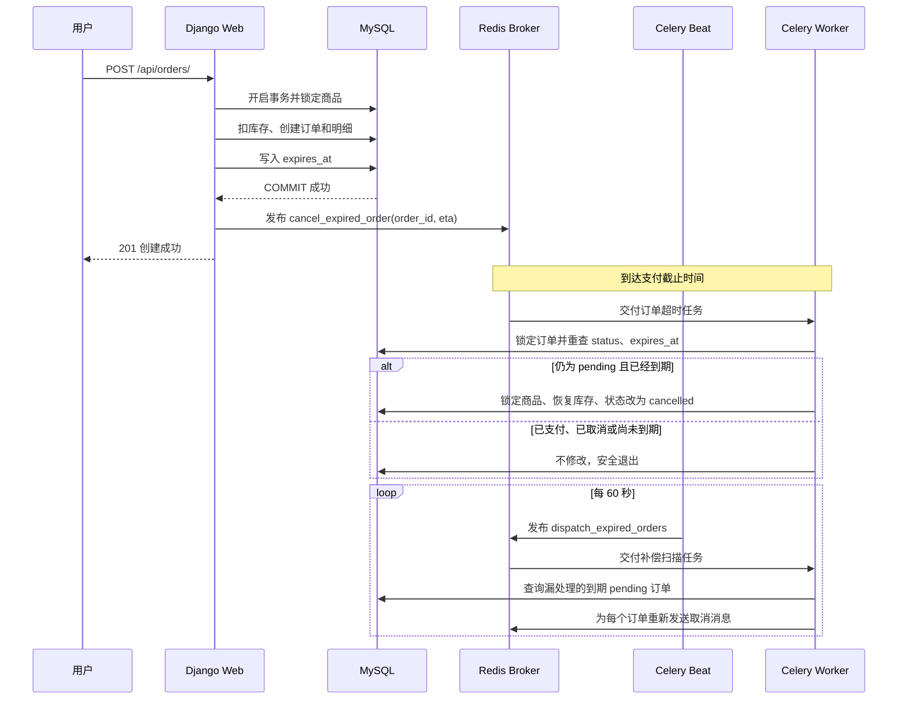

# 使用消息队列实现订单超时取消：入门设计文档

## 1. 文档目的

这份文档面向第一次接触消息队列的开发者，基于本项目已经实现的代码，解释以下问题：

- 消息队列是什么，它在订单超时取消中负责什么。
- 创建订单后，一条超时消息如何产生、等待和被消费。
- 为什么消息队列之外还需要数据库事务、行锁和定时补偿。
- 支付、人工取消、超时取消同时发生时，系统如何避免重复恢复库存。
- 本次功能修改了哪些文件，关键代码分别在哪里。

先记住一个结论：

> 消息队列只负责“到时间后提醒系统处理这个订单”，真正决定订单能不能取消的是 MySQL 中的订单状态和支付截止时间。

阅读建议：

- 第一遍先读第 2、4、5、15、16 节，建立整体概念。
- 第二遍再读第 6～14 节，把流程对应到真实代码。
- 最后阅读第 19～22 节，理解测试和方案边界。

文档中的代码片段来自当前实现。为了突出关键逻辑，部分片段省略了与主题无关的外围代码，完整实现请按文件名和函数名查看源码。

## 2. 先理解五个基本概念

### 2.1 消息

消息可以理解成一张待办卡片。

本项目发送的订单超时消息，在概念上类似：

```text
任务名称：apps.orders.tasks.cancel_expired_order
订单 ID：123
最早执行时间：2026-07-30 16:00:00
```

消息里只保存订单 ID，不保存订单状态、库存或订单明细。消费者拿到 ID 后，必须重新查询数据库。

### 2.2 生产者 Producer

生产者是发送消息的一方。

本项目中，Django Web 服务在订单事务提交后调用：

```python
cancel_expired_order.apply_async(
    args=(order_id,),
    eta=expires_at,
)
```

因此 Django Web 是生产者。

### 2.3 Broker

Broker 是接收和转发消息的中间服务，可以理解成任务中转站。

本项目复用 Redis 7：

- Redis DB 0：Django 缓存和订单防重复提交短锁。
- Redis DB 1：Celery Broker。

两个逻辑数据库分开，便于区分缓存数据和消息队列数据。

### 2.4 消费者 Consumer

消费者是从 Broker 获取消息并执行任务的一方。

本项目中的消费者是 `celery_worker`。它收到订单 ID 后调用 `expire_order(order_id)`，重新查询并锁定订单，再判断订单是否真的应该取消。

### 2.5 Celery Beat

Celery Beat 是周期调度器，可以理解成闹钟。

它本身不执行取消逻辑，而是每 60 秒向 Broker 发送一次“扫描到期订单”的任务。Worker 收到扫描任务后，查找漏处理的到期订单，再为这些订单发送取消消息。

## 3. 为什么订单超时取消适合异步处理

创建订单接口不能等待 30 分钟：

```text
用户提交订单
    -> Django 等待 30 分钟
    -> 再返回响应
```

如果这样做：

- HTTP 请求会长时间占用连接和 Web Worker。
- Django 或服务器重启后，等待中的逻辑会丢失。
- 同时创建大量订单时，大量线程或进程会被无意义地占用。

正确方式是拆成两段：

```text
同步阶段：创建订单并立即返回
异步阶段：到截止时间后，由 Celery Worker 处理取消
```

## 4. 本项目的整体设计



这套设计有两条触发路径：

1. 主路径：每个新订单提交后发送一条 ETA 消息。
2. 补偿路径：Beat 每分钟扫描数据库，重新发送漏掉的超时消息。

两条路径可能为同一订单发送重复消息，所以消费者必须幂等。

## 5. 订单状态机

本项目只有三种订单状态：

```text
pending   待支付
paid      已支付
cancelled 已取消
```

允许的状态迁移：

```text
pending -> paid
pending -> cancelled
```

禁止的状态迁移：

```text
paid -> cancelled
cancelled -> paid
cancelled -> pending
paid -> pending
```

超时取消并没有增加新的订单状态。它只是让 `pending -> cancelled` 这条状态迁移可以由消息队列自动触发。

## 6. 第一处关键修改：保存支付截止时间

文件：`apps/orders/models.py`

关键代码：

```python
expires_at = models.DateTimeField()
```

补偿扫描需要按“状态 + 截止时间”查询，因此增加联合索引：

```python
models.Index(
    fields=["status", "expires_at"],
    name="idx_order_status_expires",
)
```

对应 SQL 查询的逻辑是：

```sql
SELECT id
FROM orders_order
WHERE status = 'pending'
  AND expires_at <= NOW()
ORDER BY expires_at
LIMIT 200;
```

为什么必须把 `expires_at` 存在 MySQL：

- 订单创建后再修改系统默认超时时长，不应该改变旧订单的截止时间。
- 消息可能延迟、丢失或重复，数据库仍然能判断订单是否到期。
- 支付接口也需要读取同一个截止时间。

迁移文件：

```text
apps/orders/migrations/0002_order_expires_at.py
```

迁移会给历史订单补充“创建时间加 30 分钟”的截止时间，然后把字段改为非空。

## 7. 第二处关键修改：创建订单时计算截止时间

文件：`apps/orders/services.py`

创建订单时写入一个固定时间点：

```python
order = Order.objects.create(
    order_no=generate_order_no(),
    user=user,
    total_amount=Decimal("0.00"),
    status=Order.Status.PENDING,
    remark=remark or "",
    expires_at=timezone.now()
    + timedelta(seconds=settings.ORDER_PAYMENT_TIMEOUT_SECONDS),
)
```

默认配置：

```python
ORDER_PAYMENT_TIMEOUT_SECONDS = 1800
```

`1800` 秒就是 30 分钟。

这里保存的是绝对截止时间：

```text
2026-07-30 16:00:00
```

而不是只保存：

```text
30 分钟
```

绝对时间可以直接判断：

```python
order.expires_at <= timezone.now()
```

## 8. 第三处关键修改：事务提交后再发送消息

文件：`apps/orders/services.py`

关键代码：

```python
transaction.on_commit(
    partial(schedule_order_timeout, order.id, order.expires_at)
)
```

为什么不能在事务提交前发送：

```text
1. Django 创建订单
2. 发送超时消息
3. 后续扣库存失败
4. 数据库事务回滚
5. 队列中却已经存在一个不存在订单的消息
```

`transaction.on_commit()` 的含义是：

```text
数据库 COMMIT 成功 -> 执行发送消息函数
数据库 ROLLBACK     -> 不执行发送消息函数
```

需要注意：`on_commit()` 解决的是“数据库回滚后不应发消息”，但它不能保证 COMMIT 和 MQ 发布成为一个原子操作。

仍然可能出现：

```text
MySQL COMMIT 成功
    -> Redis 此刻不可用
    -> MQ 发布失败
```

这就是为什么还需要 Beat 补偿扫描。

## 9. 第四处关键修改：发送 ETA 消息

文件：`apps/orders/services.py`

```python
def schedule_order_timeout(order_id: int, expires_at) -> None:
    try:
        from apps.orders.tasks import cancel_expired_order

        cancel_expired_order.apply_async(
            args=(order_id,),
            eta=expires_at,
        )
    except Exception:
        logger.exception(
            "Failed to publish timeout task for order %s; "
            "the periodic sweep will retry it",
            order_id,
        )
```

参数解释：

| 参数 | 含义 |
|---|---|
| `args=(order_id,)` | 消费者执行任务时收到的订单 ID |
| `eta=expires_at` | 这个任务最早可以执行的时间 |

为什么捕获 MQ 发布异常：

- 数据库已经提交，订单已经创建成功。
- 此时不能假装整个事务还能回滚。
- 如果直接向 API 抛出 500，用户可能再次下单，反而产生重复订单。
- 系统记录错误，后续由 Beat 从数据库发现并补偿。

## 10. 第五处关键修改：定义消费者任务

文件：`apps/orders/tasks.py`

```python
@shared_task(
    bind=True,
    ignore_result=True,
    acks_late=True,
    autoretry_for=(OperationalError,),
    retry_backoff=True,
    retry_jitter=True,
    max_retries=5,
)
def cancel_expired_order(self, order_id: int):
    from apps.orders.services import expire_order

    result = expire_order(order_id)
    logger.info(
        "Order timeout task finished: order_id=%s result=%s",
        order_id,
        result,
    )
    return result
```

关键配置解释：

| 配置 | 作用 |
|---|---|
| `ignore_result=True` | 不保存任务返回值，减少不必要的数据 |
| `acks_late=True` | 任务执行完成后再确认消息 |
| `autoretry_for=(OperationalError,)` | 数据库临时异常时自动重试 |
| `retry_backoff=True` | 重试间隔逐渐增加 |
| `max_retries=5` | 最多自动重试 5 次 |

任务函数保持很薄，只负责接收消息和调用业务服务。真正的订单状态和库存逻辑仍然放在 `services.py`。

## 11. 第六处关键修改：幂等地判断订单能否取消

文件：`apps/orders/services.py`

```python
def expire_order(order_id: int, now=None) -> str:
    effective_now = now or timezone.now()

    with transaction.atomic():
        try:
            order = Order.objects.select_for_update().get(id=order_id)
        except Order.DoesNotExist:
            return ORDER_EXPIRY_MISSING

        if order.status != Order.Status.PENDING:
            return ORDER_EXPIRY_ALREADY_FINAL

        if order.expires_at > effective_now:
            return ORDER_EXPIRY_NOT_DUE

        _cancel_locked_order(order, cancelled_at=effective_now)

    return ORDER_EXPIRY_CANCELLED
```

处理顺序不能随意调整：

1. 开启数据库事务。
2. 使用 `select_for_update()` 锁定订单行。
3. 重新检查订单状态。
4. 重新检查支付截止时间。
5. 执行库存恢复和订单取消。
6. 提交事务。

任务可能返回四种结果：

| 结果 | 含义 |
|---|---|
| `cancelled` | 本次成功取消了到期订单 |
| `not_due` | 消息到得太早，订单尚未到期 |
| `already_final` | 订单已经支付或取消，无需处理 |
| `missing` | 订单不存在，无需处理 |

这里的幂等不是“消息绝对不会重复”，而是：

> 同一订单的消息即使执行多次，只有第一次合法的取消会修改订单和库存，后续执行安全退出。

## 12. 第七处关键修改：恢复库存

文件：`apps/orders/services.py`

```python
def _cancel_locked_order(order: Order, cancelled_at=None) -> None:
    quantities_by_product = defaultdict(int)
    order_items = order.items.values_list(
        "product_id",
        "quantity",
    ).order_by("product_id")

    for product_id, quantity in order_items:
        quantities_by_product[product_id] += quantity

    affected_product_ids = tuple(quantities_by_product)
    products = Product.objects.select_for_update().filter(
        id__in=affected_product_ids
    ).order_by("id")

    for product in products:
        quantity = quantities_by_product[product.id]
        product.stock += quantity
        product.sales_count = max(
            product.sales_count - quantity,
            0,
        )
        product.save(
            update_fields=["stock", "sales_count", "updated_at"]
        )

    order.status = Order.Status.CANCELLED
    order.cancelled_at = cancelled_at or timezone.now()
    order.save(
        update_fields=["status", "cancelled_at", "updated_at"]
    )
```

为什么还要锁商品行：

- 订单行锁保护订单状态只能迁移一次。
- 商品行锁保护恢复库存时不覆盖其他并发库存修改。
- 商品按 ID 排序后加锁，可以降低多个订单以不同顺序锁商品导致死锁的概率。

库存恢复和订单状态修改位于同一个 `transaction.atomic()` 中：

```text
库存恢复成功 + 订单取消成功 -> 一起提交
任意一步失败                -> 一起回滚
```

## 13. 第八处关键修改：防止过期订单继续支付

文件：`apps/orders/services.py`

如果 Worker 堵塞，可能出现：

```text
订单已经超过 expires_at
但超时消息还没有执行
数据库状态暂时仍为 pending
```

因此支付接口不能只检查 `status == pending`，还必须检查截止时间：

```python
now = timezone.now()
if order.expires_at <= now:
    _cancel_locked_order(order, cancelled_at=now)
    expired = True
else:
    order.status = Order.Status.PAID
    order.paid_at = now
    order.save(
        update_fields=["status", "paid_at", "updated_at"]
    )
```

事务提交后向用户返回明确错误：

```python
if expired:
    raise BusinessException(
        "订单已超时取消",
        code=40005,
    )
```

这样数据库截止时间始终有效，不依赖消息是否准时执行。

## 14. 第九处关键修改：补偿扫描

配置文件：`config/settings.py`

```python
CELERY_BEAT_SCHEDULE = {
    "dispatch-expired-orders": {
        "task": "apps.orders.tasks.dispatch_expired_orders",
        "schedule": ORDER_TIMEOUT_SWEEP_INTERVAL_SECONDS,
        "options": {
            "expires": ORDER_TIMEOUT_SWEEP_INTERVAL_SECONDS
        },
    }
}
```

扫描任务：`apps/orders/tasks.py`

```python
@shared_task(ignore_result=True)
def dispatch_expired_orders():
    order_ids = list(
        Order.objects.filter(
            status=Order.Status.PENDING,
            expires_at__lte=timezone.now(),
        )
        .order_by("expires_at")
        .values_list("id", flat=True)[
            : settings.ORDER_TIMEOUT_SWEEP_BATCH_SIZE
        ]
    )

    for order_id in order_ids:
        cancel_expired_order.delay(order_id)

    return len(order_ids)
```

扫描任务只负责找订单和重新发消息，不复制库存恢复逻辑。

默认每次最多扫描 200 条：

```python
ORDER_TIMEOUT_SWEEP_BATCH_SIZE = 200
```

如果一次有 500 条到期订单：

```text
第一轮最多发送 200 条
第二轮继续处理剩余订单
后续轮次直到处理完成
```

## 15. 支付和超时任务同时发生时会怎样

### 场景 A：支付先拿到订单锁

```text
支付请求锁定订单
    -> 检查未超时
    -> pending 改为 paid
    -> 提交并释放锁

超时任务随后锁定订单
    -> 看到 paid
    -> 返回 already_final
    -> 不恢复库存
```

### 场景 B：到期任务先拿到订单锁

```text
超时任务锁定订单
    -> 检查 pending 且已经到期
    -> 恢复库存
    -> pending 改为 cancelled
    -> 提交并释放锁

支付请求随后锁定订单
    -> 看到 cancelled
    -> 拒绝支付
```

### 场景 C：同一超时消息执行两次

```text
第一次：
pending -> cancelled，恢复一次库存

第二次：
看到 cancelled，直接退出
```

“先加锁，再重查状态”比“先在事务外查询状态”更重要，因为事务外查到的 `pending` 可能在真正修改前已经被另一个请求改变。

## 16. 六种机制分别解决什么问题

| 机制 | 保护对象 | 生命周期 | 不负责什么 |
|---|---|---|---|
| Celery 消息 | 异步触发订单检查 | 发布到任务执行 | 不保证订单一定能取消 |
| `transaction.on_commit()` | 提交后再执行回调 | 当前数据库事务 | 不能让 MySQL 与 Redis 成为一个原子事务 |
| 订单行锁 | 订单状态迁移 | 当前数据库事务 | 不负责消息投递 |
| 商品行锁 | 库存和销量修改 | 当前数据库事务 | 不负责判断订单是否到期 |
| `transaction.atomic()` | 多条数据库修改一起提交或回滚 | `with` 代码块 | 它本身不是锁，也不负责异步调度 |
| Celery Beat | 漏消息补偿 | 周期运行 | 不能替代消费者幂等 |

不能简单地说“使用消息队列保证一致性”。更准确的说法是：

> Celery 负责异步触发和失败后的再次触发；MySQL 中的截止时间、状态重检、事务和行锁共同维护订单与库存的一致性。

## 17. Celery 配置和启动

Celery 初始化文件：`config/celery.py`

```python
app = Celery("mini_ecommerce")
app.config_from_object(
    "django.conf:settings",
    namespace="CELERY",
)
app.autodiscover_tasks()
```

Broker 配置：`config/settings.py`

```python
CELERY_BROKER_URL = (
    f"redis://{REDIS_HOST}:{REDIS_PORT}/{CELERY_BROKER_DB}"
)
```

Docker Compose 新增两个服务：

```yaml
celery_worker:
  command:
    - celery
    - -A
    - config
    - worker
    - --loglevel=info
    - --concurrency=2

celery_beat:
  command:
    - celery
    - -A
    - config
    - beat
    - --loglevel=info
```

三类进程不要混淆：

| Compose 服务 | 容器内主要进程 | 作用 |
|---|---|---|
| `web` | Gunicorn | 接收 HTTP 请求 |
| `celery_worker` | Celery Worker | 执行异步任务 |
| `celery_beat` | Celery Beat | 周期发送扫描任务 |

## 18. 环境变量

`.env.example` 中新增：

```env
CELERY_BROKER_DB=1
ORDER_PAYMENT_TIMEOUT_SECONDS=1800
ORDER_TIMEOUT_SWEEP_INTERVAL_SECONDS=60
ORDER_TIMEOUT_SWEEP_BATCH_SIZE=200
```

| 配置 | 默认值 | 说明 |
|---|---:|---|
| `CELERY_BROKER_DB` | `1` | Redis Broker 使用的逻辑数据库 |
| `ORDER_PAYMENT_TIMEOUT_SECONDS` | `1800` | 新订单支付时限 |
| `ORDER_TIMEOUT_SWEEP_INTERVAL_SECONDS` | `60` | 补偿扫描间隔 |
| `ORDER_TIMEOUT_SWEEP_BATCH_SIZE` | `200` | 每轮最多扫描多少订单 |

修改支付时限只影响修改后创建的新订单。旧订单仍使用已经写入自己的 `expires_at`。

## 19. 测试覆盖

测试文件：`apps/orders/tests.py`

本次增加的关键测试：

| 测试 | 验证内容 |
|---|---|
| `test_order_timeout_task_is_published_only_after_commit` | 事务提交前不发布消息 |
| `test_timeout_task_cancels_order_once_and_restores_stock_once` | 重复消息只恢复一次库存 |
| `test_timeout_task_does_not_cancel_before_deadline` | 提前执行不会误取消 |
| `test_paid_order_is_ignored_by_timeout_task` | 已支付订单不会被取消 |
| `test_pay_endpoint_cancels_order_when_deadline_has_passed` | MQ 延迟时仍禁止过期支付 |
| `test_sweep_dispatches_only_overdue_pending_orders` | 补偿任务只选择已到期待支付订单 |

当前验证结果：

```text
本地全量测试：64/64 通过
Docker 内全量测试：64/64 通过
Django system check：通过
迁移 0002_order_expires_at：已应用
Web -> Redis Broker -> Worker：真实消息消费通过
Beat -> Redis Broker -> Worker：周期消息消费通过
```

## 20. 本次修改文件清单

| 文件 | 修改目的 |
|---|---|
| `requirements.txt` | 增加 Celery 依赖 |
| `config/celery.py` | 创建 Celery 应用并自动发现任务 |
| `config/__init__.py` | Django 启动时加载 Celery 应用 |
| `config/settings.py` | Broker、ETA、Beat 和超时参数配置 |
| `apps/orders/models.py` | 增加 `expires_at` 和联合索引 |
| `apps/orders/migrations/0002_order_expires_at.py` | 修改数据库结构并回填历史订单 |
| `apps/orders/services.py` | 事务后投递、到期检查、幂等取消和支付兜底 |
| `apps/orders/tasks.py` | 超时消费者和补偿扫描任务 |
| `apps/orders/serializers.py` | API 返回 `expires_at` |
| `apps/orders/admin.py` | 后台展示支付截止时间 |
| `apps/orders/tests.py` | 覆盖消息投递、幂等和并发边界 |
| `docker-compose.yml` | 增加 Worker、Beat 和共享环境配置 |
| `scripts/entrypoint.sh` | 避免三个容器同时执行迁移 |
| `.env.example` | 增加消息队列和超时参数示例 |

## 21. 初学者常见疑问

### 消息到了就一定取消订单吗？

不一定。消费者还要检查：

```text
订单存在
并且 status = pending
并且 expires_at <= 当前时间
```

三个条件都满足才取消。

### Redis Broker 和 Redis 缓存是一回事吗？

它们使用同一个 Redis 服务，但用途不同，并使用不同逻辑数据库：

```text
DB 0：缓存和短锁
DB 1：Celery Broker
```

### 为什么消息里只放订单 ID？

因为消息中的订单状态可能已经过时。只传 ID，可以让消费者始终以 MySQL 最新数据为准。

### 为什么消息允许重复？

分布式系统中，网络超时、Worker 重启、消息重新投递都可能产生重复执行。与其假设消息只来一次，不如让消费者重复执行也安全。

### 为什么不用 `time.sleep(1800)`？

`sleep` 会占用进程，服务重启后等待状态丢失，也不适合大量订单。

### 为什么不只使用 Beat 扫描？

ETA 消息可以在订单截止时间附近主动触发；Beat 扫描负责故障补偿。当前项目为了展示完整消息队列链路同时使用两者。

### 是否可以说消息队列保证了订单一致性？

不建议这样说。更准确的表述是：

> 消息队列负责异步触发超时处理；数据库事务、订单行锁、商品行锁、状态和截止时间重检负责一致性。

## 22. 当前方案的边界

当前方案适合本项目和中小规模业务演示，但仍需要理解以下边界：

- Celery ETA 表示最早执行时间，不保证在那个时间点精确执行。
- Redis Broker 或 Worker 停机时，任务可能延迟，因此保留 Beat 补偿和支付接口截止校验。
- ETA 任务可能提前被 Worker 取走并保留在内存中，大规模、长时间延迟任务需要重新评估调度方案。
- Beat 应只部署一个实例，否则会重复发送扫描任务；即使误部署多个，消费者幂等仍能避免重复恢复库存。
- 当前没有实现 Transactional Outbox；发布失败依赖数据库扫描补偿。

如果未来订单量非常大，可以考虑：

- 只使用带联合索引的分片扫描。
- 使用 RabbitMQ TTL + 死信队列或延迟消息插件。
- 增加 Transactional Outbox，独立投递数据库中的事件记录。
- 按订单 ID 分区任务队列并增加队列积压监控。

这些属于后续扩展，不是当前项目已实现的功能。

## 23. 推荐阅读顺序

第一次阅读时，建议按这个顺序打开代码：

1. `apps/orders/models.py`：先看订单状态和 `expires_at`。
2. `apps/orders/services.py` 的 `create_order_from_cart()`：看订单如何创建。
3. 同文件的 `schedule_order_timeout()`：看如何发送消息。
4. `apps/orders/tasks.py` 的 `cancel_expired_order()`：看消费者入口。
5. `apps/orders/services.py` 的 `expire_order()`：看幂等判断。
6. 同文件的 `_cancel_locked_order()`：看库存如何恢复。
7. `apps/orders/tasks.py` 的 `dispatch_expired_orders()`：看补偿扫描。
8. `apps/orders/tests.py`：通过测试理解边界条件。

配套的运行和故障处理文档见：

```text
docs/order_timeout.md
```

## 24. 参考资料

- [Celery：Django 集成](https://docs.celeryq.dev/en/stable/django/first-steps-with-django.html)
- [Celery：任务调用、ETA 与 countdown](https://docs.celeryq.dev/en/stable/userguide/calling.html#eta-and-countdown)
- [Celery：Redis Broker 与 visibility timeout](https://docs.celeryq.dev/en/stable/getting-started/backends-and-brokers/redis.html#visibility-timeout)
- [Django：transaction.on_commit](https://docs.djangoproject.com/en/5.2/topics/db/transactions/#performing-actions-after-commit)
